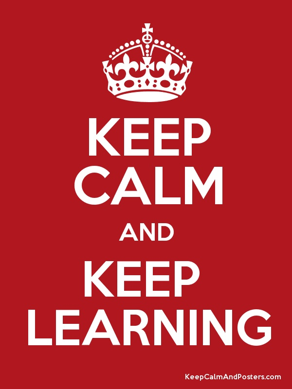

### Final Task For First Quater of the First Year

## *Итоговое задание первой четверти первого года обучения:*

1. *Создать репозиторий на GitHub*
2. *Нарисовать блок-схему алгоритма (можно обойтись блок-схемой основной содержательной части, если вы выделяете её в отдельный метод)*
3. *Снабдить репозиторий оформленным текстовым описанием решения (файл README.md)*
4. *Написать программу, решающую поставленную задачу*
5. *Использовать контроль версий в работе над этим небольшим проектом (не должно быть так, что всё залито одним коммитом, как минимум этапы 2, 3, и 4 должны быть расположены в разных коммитах)*

# *Описание решения задачи:*
*Решение в папке **task*** 

> Принимаем от пользователя **строку**, преобразуем в массив используя пробел, как разделитель массива

> Создаем второй массив _**размерностью до 3**_

> Заполняем  через *цикл* второй массив из первого через создание рандомного числа *в границах длины первого массива*, которое будет индексом элемента из первого массива, которое будет равно i-тым элементом второго массива. 

> Выводим на печать оба массива

